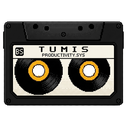

# 💾 TUMIS (Tugas, Waktu dan Musik)

<p align="center">
  
</p>

<p align="center">
  <strong>Y2K Light Terminal Desktop Application</strong><br>
  Aesthetic Pomodoro Timer, Kanban Task Manager, and Chiptune Synthesizer / Local Music Player.
</p>

<p align="center">
  
  
  
</p>

---

## 📥 Unduh & Pasang (Download)

Anda dapat langsung mengunduh berkas instalasi resmi **TUMIS** untuk Windows (64-bit) melalui tombol di bawah ini:

<p align="center">
  <a href="https://github.com/zidanLPTP/TumisApp/raw/master/release/Tumis_Setup_x64.msi">
    
  </a>
</p>

---

## 🍲 Tentang Proyek

**TUMIS** adalah aplikasi desktop produktivitas terintegrasi yang menggabungkan manajemen tugas (**Tugas**), pengatur waktu fokus (**Waktu**), dan pemutar audio (**Musik**) dalam satu antarmuka tunggal. 

Proyek ini merupakan bagian dari karya kreatif **Bumbu Studio**, yang dirancang dengan estetika visual **Y2K Light Terminal** tingkat premium. Jendela aplikasi dibuat tanpa batas bingkai (*borderless*) dan transparan, menyerupai monitor komputer tabung (CRT) abu-abu tahun 90-an yang melengkung mulus di atas layar desktop laptop/PC Anda.

---

## ✨ Fitur Utama

### 1. 📁 TUGAS.EXE (Papan Kanban)
*   **3 Kolom Alur Kerja**: `[ BELUM ]`, `[ SEDANG ]`, dan `[ SELESAI ]` untuk memantau progres tugas.
*   **Drag-and-Drop Asli**: Pindahkan kartu tugas dengan mouse secara dinamis, lengkap dengan animasi getar (*shake*) retro saat kartu disorot (*hover*).
*   **Neo-Geo Pixel Art Character**: Karakter piksel interaktif yang duduk mengetik di depan PC mini dengan uap kopi membubung jika Anda sedang fokus bekerja. Karakter akan berdiri santai saat Anda beristirahat atau ketika timer dihentikan.
*   **Penyimpanan Lokal**: Otomatis menyimpan daftar tugas ke `localStorage` agar tidak hilang saat aplikasi ditutup.

### 2. ⏱️ WAKTU.SYS (Timer Pomodoro)
*   **Tampilan LCD Neon**: Jam hitung mundur digital dengan warna merah neon menyala menggunakan font retro **`VT323`**.
*   **Konfigurasi Fleksibel**: Atur durasi kerja dan istirahat secara bebas melalui form input bertema terminal CLI yang dilengkapi kursor `_` yang berkedip lembut saat fokus mengetik.
*   **Sebab-Akibat Cerdas**: Timer menolak berjalan jika kolom **[ SEDANG ]** kosong, memaksa Anda menaruh tugas prioritas terlebih dahulu sebelum mulai fokus.
*   **Alarm Retro Chiptune**: Alarm 8-bit disintesis secara real-time menggunakan Web Audio API dengan tingkat volume pintar (+20% di atas volume pemutar musik, maks 100%) untuk mencegah efek terkejut.

### 3. 🎵 AUDIO.DLL (Pemutar Musik & YouTube Downloader)
*   **Vinyl Deck Animasi**: Piringan hitam piksel pastel yang berputar saat musik diputar. Jarum turntable (*turntable arm*) akan bergerak turun ke piringan dan bergetar halus (*bass jiggle*) mengikuti irama lagu.
*   **Pemindai Folder Lokal**: Pindai seluruh berkas musik lokal (`.mp3`, `.wav`, `.m4a`) di komputer Anda secara instan menggunakan modul pemindai filesystem berbasis Rust.
*   **YouTube Audio Downloader**: Unduh lagu fokus favorit Anda langsung dari YouTube ke folder musik lokal Anda menggunakan modul integrasi biner `yt-dlp` tanpa perlu bergantung pada instalasi `ffmpeg`.
*   **Autoplay & Fade Out**: Musik otomatis berputar ketika timer dimulai, berganti ke lagu berikutnya saat habis, dan melakukan *fade-out* (volume mengecil perlahan) saat sesi kerja berakhir.

---

## 🎨 Detail Desain Premium (Y2K Light Terminal)
*   **Borderless & Transparent Window**: Jendela luar Windows dihilangkan seutuhnya, menyisakan bodi monitor CRT retro yang menawan.
*   **Interactive Drag Region**: Seluruh bodi TV tabung (casing abu-abu) dapat diklik dan digeser ke mana saja layaknya jendela sistem operasi standar, dengan pengecualian elemen-elemen kontrol yang tetap dapat ditekan dengan aman.
*   **CRT Monitor Effect**: Tampilan layar yang melengkung cembung, efek garis scanlines monitor tabung lama, bias warna chromatic aberration tipis, serta kelap-kelip cahaya frekuensi rendah (*slow flicker*).

---

## 🛠️ Panduan Instalasi & Menjalankan Aplikasi

### Prasyarat Sistem
Pastikan komputer Anda memiliki perangkat lunak berikut:
1.  **Node.js** (v18 ke atas) & **npm**
2.  **Rust Compiler** & **Cargo** (untuk membangun backend Tauri)
3.  **Deno JS Runtime** (wajib terpasang di sistem PATH jika ingin menggunakan fitur YouTube Downloader untuk memecahkan sandi YouTube terbaru: `winget install --id=DenoLand.Deno`)

> [!NOTE]
> Biner pengunduh **`yt-dlp.exe`** terbaru sudah dipaketkan secara internal di dalam aplikasi sebagai *Tauri Resource Bundle*. Anda tidak perlu lagi mengunduh atau menginstal `yt-dlp` terpisah di komputer Anda!


### Langkah-Langkah Menjalankan
1.  **Klon Repositori**:
    ```bash
    git clone https://github.com/zidanLPTP/TumisApp.git
    cd TumisApp
    ```

2.  **Instal Dependensi**:
    ```bash
    npm install
    ```

3.  **Jalankan Aplikasi dalam Mode Pengembangan**:
    ```bash
    npm run tauri dev
    ```
    Tauri akan mengompilasi kode backend Rust dan membuka jendela monitor retro Y2K secara otomatis.

---

## 🧑‍💻 Struktur Proyek
```text
├── src/                    # Frontend Aset (Zero-Framework HTML, CSS & JS)
│   ├── index.html          # Halaman Antarmuka Utama & Broker Event
│   ├── index.css           # Variabel Warna, Layout Bento, CRT Filter & Animasi
│   ├── kanban.js           # Kelas Manajemen Tugas & Animasi Karakter Piksel
│   ├── timer.js            # Kelas Pomodoro Timer, LCD Screen & Alarm Synth
│   └── audio.js            # Kelas Audio Player, Vinyl & YouTube Downloader Link
├── src-tauri/              # Backend Rust (Tauri Core)
│   ├── src/
│   │   ├── main.rs         # Titik Masuk Utama
│   │   └── lib.rs          # Command Rust (scan_music_folder, download_youtube_audio)
│   ├── capabilities/       # File Izin Fitur (Window controls, startDragging)
│   └── tauri.conf.json     # Konfigurasi Dimensi, Transparansi, & Borderless Jendela
└── package.json            # Daftar Skrip NPM & Dependensi
```

---

## 🤝 Kontributor & Lisensi
Proyek ini dibuat untuk mendukung produktivitas kerja yang seru dan berjiwa klasik.

*   **Pencipta**: **Bumbu Studio**
*   **Repository**: [zidanLPTP/TumisApp](https://github.com/zidanLPTP/TumisApp)

*Enjoy your task, manage your time, and play your music!* 💾🍲⏱️
